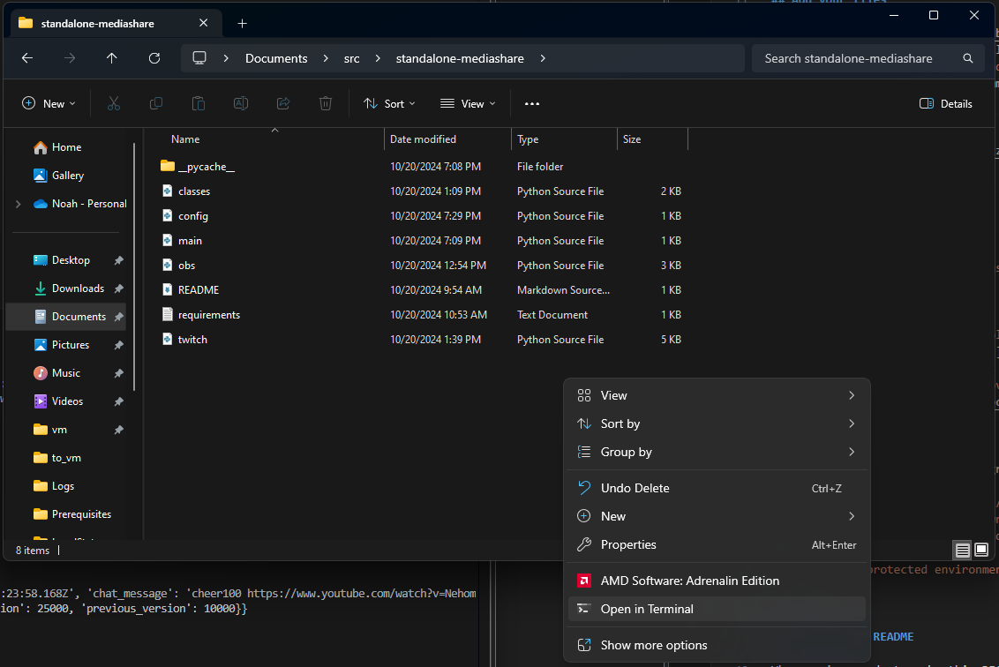

# Twitch Subathon Timer in Python  

## Getting Started  
### Python  
Open a PowerShell windows and type the python3 command.  
If you have python3 installed, it should drop you into a python3 interpreter. Type "quit()" to exit and proceed to the next section.  

Otherwise, it should open the Windows store. Press install to install the latest version of python3.  

Install python dependencies:  
Right click the folder where you unzipped this project without selecting a file.  
Click "Open in terminal" from the presented options.  
  

In the terminal, type the following command:  
`python3 -m pip install -r requirements.txt`

### OBS:  
Tools -> WebSocket Server Settings -> Enable WebSocket Server  
Tools -> WebSocket Server Settings -> Enable authentication  
Tools -> WebSocket Server Settings -> Show Connect Info  
Copy the password to config.py into the field OBS_WEBSOCKET_PASSWORD  

Create a Text (GDI+) Source and add it to a scene.  
Put the name of the Source into config.py as the field OBS_SCENEITEM_NAME

### Twitch:  
Every time you run the app you will be prompted through your default browser to authorize the script to run.  
The Device Authentication Token you will receive from Twitch is only valid for 30 days and you'll have to close the terminal and reopen it to extend the timer every 30 days, but it pulls the time from the OBS source and shouldn't take long to restart.

### Subathon Timer:  
Modify config.py to ensure it has only valid values.  
App Token is specific to this app and should remain the same.  

## Running the app  
Running the app is simple provided the config file is valid.  

Follow the above steps for opening a PowerShell prompt in the current directory.  
In PowerShell:  
`python3 main.py`  

## Terminal Commands
- integer or HH:MM:SS value -> add (or remove if negative) time from the clock
- p -> pause the timer, it will still receive donations, just will not count down
- r -> resume the timer or restart from DEFAULT_START_TIME if timer hits 0 or the text is no longer able to be read
- q -> quit the timer, kill the Twitch and OBS connections and let the app die gracefully
- s -> set the timer to an exact time, there will be a follow on prompt to input seconds or HH:MM:SS times  

## How it works  
### Twitch Thread
The app works by connecting to the Twitch EventSub WebSocket in one thread to receive incoming Bits, Subscription, and/or Channel Points events. When a Bits donation above the TRIGGER_BIT_VALUE threshhold (defined in config.py) is received or a subscription is received, the value is calculated based on the related constant in the config.py and added to the timer.

This is not an atomic clock and it may add very minute fractions of seconds over time due to runtime, but it shouldn't be an exceptional amount of time added and shouldn't even be noticable. If it is, post an issue to GitHub and I'll try and refine it further.

### OBS Thread  
The OBS Thread is spun up as needed and only exists while there is a timer counting down.  

The OBS Thread will connect to the OBS WebSocket and attempt to find the correct text source. It will then change the text to the body of the timer.

The thread continues this loop until the timer hits 0, and then dies gracefully, closing the connection to the OBS WebSocket in the process.

## TODO
- Revisit the time parsing section.
- Add support for multimonth subs?

## Considerations  
*How do I pause the timer?*  
Type p in the terminal where the timer is running and hit enter, or make the OBS SceneItem hidden. It will resume when you either unhide the sceneitem or type r and hit enter to resume.  

*How can I quickly add or remove time from the timer?*  
Just type a time as either seconds or HH:MM:SS format in the terminal and hit enter. To remove time, type something like -1:30 or -600.

*Can you make a nice web page as a landing zone to let me see click buttons instead of typing in the terminal?*  
No.  

*Some weird error came up or something just isn't working for me.*  
Email a screenshot and anything helpful you can add to support@maskarauder.com, I'll get to it when I can.
